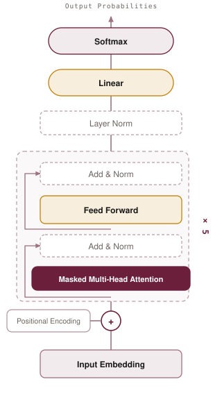

# Tiny GPT

This is a small GPT style language model that I wrote from scratch in PyTorch. The
tokenizer, the positional encodings, the causal attention mask, the training loop and
the sampler are all written by hand. The only thing I lean on is PyTorch itself.

I trained it on [TinyStories](https://huggingface.co/datasets/roneneldan/TinyStories),
a corpus of very short children's stories written with a simple vocabulary. The
stories are simple enough that a model this small can actually learn to write
coherent English, and the whole training run finishes in well under an hour on a
laptop with Apple Silicon.

The biggest version has about 7.1 million parameters and reaches a validation
perplexity of 8.08. It writes short stories that keep the same characters and setting
going for several sentences.

## Architecture

<p align="center">
  <picture>
    <source media="(prefers-color-scheme: dark)" srcset="assets/architecture-dark.svg">
    
  </picture>
</p>

## How I built it

### 1. A byte level BPE tokenizer

I trained a byte level BPE tokenizer on the TinyStories text with a vocabulary of
3,000 tokens. Byte level means every raw byte gets mapped to a visible character
before the merges run, so any UTF-8 string can be encoded. There are two special
tokens, `<unk>` for anything unseen and `<eos>` to mark the end of a story. A small
vocabulary keeps the embedding table cheap, which matters a lot when the whole model
is only a few million parameters.

### 2. A token stream to train on

The TinyStories files separate stories with `<|endoftext|>`, so I split on that,
tokenize all the stories in one batch, and glue the token IDs together into one long
stream with an `<eos>` between stories. The dataset then hands out overlapping windows
of 257 tokens. The first 256 are the input and the same window shifted by one position
is the target, which is the standard next token objective.

### 3. The model

Token IDs go into an embedding table, get scaled by the square root of the model
dimension, and then have sinusoidal positional encodings added on top. The positional
signal is a fixed pattern of sine and cosine waves, so it costs zero parameters and
generalizes cleanly across positions.

From there the signal passes through five identical transformer blocks. Each block is
pre-norm, so a LayerNorm runs before each sublayer and a residual connection wraps
around it. The first sublayer is multi head causal self attention with a head
dimension of 32. The second is a two layer feed forward network with a GELU in the
middle. After the last block there is a final LayerNorm and then an output projection
back to vocabulary size.

The output projection shares its weight matrix with the token embedding table. That
saves a full `vocab x d_model` block of parameters and keeps the input and output
spaces aligned.

### 4. The training loop

I use AdamW with betas of 0.9 and 0.95, weight decay 0.1, and a base learning rate of
3e-4. The learning rate warms up linearly over the first 300 steps and then follows a
cosine decay down to 10 percent of the base value. Gradient norms are clipped at 1.0.
Every 500 steps the loop measures validation loss and saves a checkpoint whenever the
loss improves.

One useful sanity check is the very first loss value. With a vocabulary of 3,000 a
model that has learned nothing should sit around `ln(3000) = 8.006`, and that is
roughly where the first logged loss lands.

### 5. Three model sizes

I trained three configurations under identical settings so the only thing changing is
capacity. All three share a vocabulary of 3,000, a context length of 256, dropout of
0.1, and a head dimension of 32. They differ in width and depth only.

| Model  | d_model | heads | layers | d_ff | Parameters |
|--------|:-------:|:-----:|:------:|:----:|:----------:|
| small  |   128   |   4   |   5    | 256  |  1,046,656 |
| medium |   256   |   8   |   5    | 512  |  3,404,032 |
| large  |   384   |  12   |   5    | 768  |  7,072,128 |

### 6. Sampling

Generation is a plain autoregressive loop. The model sees the last 256 tokens, I take
the logits at the final position, divide them by the temperature, optionally filter
them with top-k or nucleus sampling, turn them into probabilities, and draw one token.
That token gets appended and the loop runs again until it hits `<eos>` or the token
budget.

## Results

Each model ran for 5,000 steps with a batch size of 64 and a context length of 256.
Validation numbers come from the held out split.

| Model  | Parameters | Final val loss | Perplexity |
|--------|:----------:|:--------------:|:----------:|
| small  |  1,046,656 |     2.8764     |   17.75    |
| medium |  3,404,032 |     2.3249     |   10.23    |
| large  |  7,072,128 |     2.0889     |    8.08    |

The scaling story is clean. The large model is more than twice as certain about the
next token as the small one, and the difference shows up in the text as well as in the
numbers. It holds a setting and a cast of characters together across several sentences,
while the smaller models drift into repetition loops after a sentence or two.

### A sample from the large model

> Once upon a time, in an ancient tree. In this forest lived many friends, like birds
> and the other bugs... The squirrels were all playing in a tree and were very careful
> not the birds that were not like birds, and they all lived together in a small
> village with a kind girl named Amy and the squirrels, always together and sharing.

### Temperature sweep, same prompt, medium model

- T = 0.5 gives the most coherent text. It reads like a real children's story and it
  repeats phrases often.
- T = 0.8 to 1.0 is the sweet spot. Readable stories with a reasonable amount of
  variety.
- T = 1.2 gets more creative, inventing things like a frog named Fin, and the grammar
  and logic start to slip.

## Usage

```bash
pip install torch tokenizers

# 0. Download the TinyStories text files into ./data
#    (TinyStoriesV2-GPT4-train.txt, TinyStoriesV2-GPT4-valid.txt)

# 1. Train the BPE tokenizer (vocab 3,000)
python -m src.tokenizer --train-file data/TinyStoriesV2-GPT4-train.txt --out tokenizer.json

# 2. Train the model (small | medium | large)
python -m src.train --size large \
    --train-file data/TinyStoriesV2-GPT4-train.txt \
    --valid-file data/TinyStoriesV2-GPT4-valid.txt \
    --tokenizer tokenizer.json \
    --save-path tinylm_checkpoint.pt

# 3. Generate text
python -m src.generate --checkpoint tinylm_checkpoint.pt \
    --tokenizer tokenizer.json \
    --prompt "Once upon a time," --temperature 0.8
```

## Project layout

```
src/
  tokenizer.py   Byte level BPE training (vocab 3,000, <unk>/<eos>)
  data.py        Story splitting, tokenization, and the token stream Dataset
  model.py       SinusoidalPositionalEncoding, TransformerBlock, TinyLM and sizes
  train.py       AdamW with warmup and cosine decay, grad clipping, eval, checkpoints
  generate.py    Autoregressive sampling (temperature, top-k, nucleus)
```

## Notes on Apple Silicon

Everything trains comfortably on a single Apple Silicon GPU through PyTorch MPS, and
it also runs on CUDA or CPU. Two small details make the MPS path stable. I build the
causal mask myself and pass it in as an explicit additive mask, since the `is_causal`
fast path can produce NaNs there. And I fill the masked positions with `-1e9`, which
behaves better than negative infinity on that backend while still driving those
attention weights to zero.
